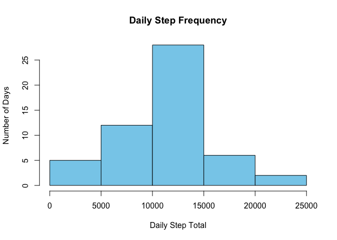
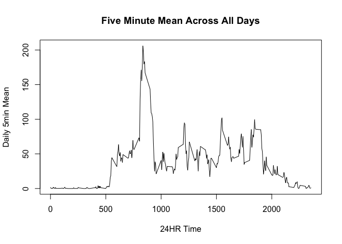
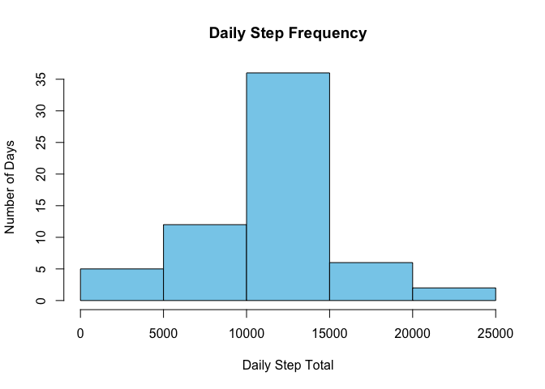
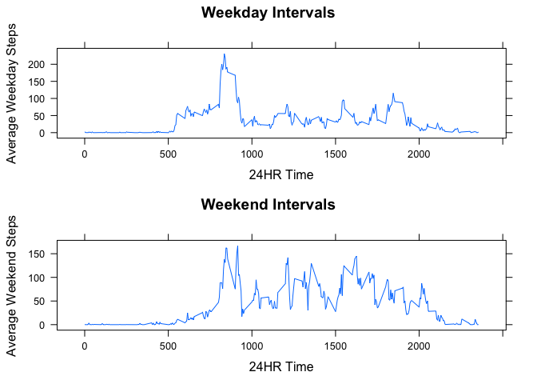

# Reproducible Research: Peer Assessment 1


## Loading and preprocessing the data


```r
setwd("~/RepData_PeerAssessment1/")
unzip("activity.zip")
actdata1 <- read.csv("activity.csv")
actdata2 <- na.omit(actdata1)
```


## What is the mean total number of steps taken per day?

A histogram of the total number of steps taken each day ignoring missing values.


```r
day_steps <- NULL
day_chunks <- split(actdata2,actdata2$date,drop=TRUE)
for (i in 1:length(day_chunks)) {
     day_steps[i] <- sum(day_chunks[[i]][,1])
}     
par(mfrow=c(1,1))
hist(day_steps,col="sky blue",breaks=07,
     xlab="Daily Step Total",ylab="Number of Days",main="Daily Step Frequency")
```

 

The mean total number of steps taken per day.


```r
period_mean <- mean(day_steps)
print(period_mean)
```

```
## [1] 10766.19
```

The median total number of steps taken per day.


```r
period_median <- median(day_steps)
print(period_median)
```

```
## [1] 10765
```

## What is the average daily activity pattern?


```r
day_interval <- as.ts(actdata2[1:288,3])
interval_mean <- by (actdata2[,1],as.factor(actdata2[,3]),mean)
plot.ts(day_interval,interval_mean,type="l",ylab="Daily 5min Mean",xlab="24HR Time",
        main="Five Minute Mean Across All Days")
```

 

Five-minute interval, on average across all the days in the dataset, containing the maximum number of steps.


```r
max_mean <- which.max(interval_mean)
actdata2[max_mean,3]
```

```
## [1] 835
```

## Imputing missing values

The total number of missing values in the original dataset.


```r
where_na <- which(is.na(actdata1[,1])==TRUE)
count_na <- length(where_na)
print(count_na)
```

```
## [1] 2304
```

New dataset equal to original dataset with missing data filled with interval mean.


```r
filldata <- actdata1
filldata[where_na,1] <- interval_mean[paste(filldata$interval[where_na],"",sep="")]
```

A histogram of the total number of steps taken each day with missing data filled with interval mean.


```r
fill_day_chunks <- split(filldata,filldata$date,drop=TRUE)
fill_day_steps <- NULL
for (i in 1:length(fill_day_chunks)) {
  fill_day_steps[i] <- sum(fill_day_chunks[[i]][,1])
}     
par(mfrow=c(1,1))
hist(fill_day_steps,col="sky blue",breaks=07,
     xlab="Daily Step Total",ylab="Number of Days",main="Daily Step Frequency")
```

 

The mean total number of steps taken per day.


```r
fill_period_mean <- mean(fill_day_steps)
print(fill_period_mean)
```

```
## [1] 10766.19
```

The median total number of steps taken per day.


```r
fill_period_median <- median(fill_day_steps)
print(fill_period_median)
```

```
## [1] 10766.19
```

These values are similar to the estimates from the first part of the assignment because replacing the missing data with the mean estimates produces approximately the same total daily number of steps.

## Are there differences in activity patterns between weekdays and weekends?

Create a new factor variable in the dataset with two levels -- "weekday" and "weekend" indicating whether a given date is a weekday or weekend day.


```r
day <- weekdays(as.Date(filldata$date))
filldata[,4] <- ifelse(day %in% c("Saturday", "Sunday"), "weekend", "weekday")
days <- as.factor(filldata[,4])
split_days <- split(filldata,days,drop=TRUE)
```


A panel plot of the 5-minute interval and the average number of steps taken, averaged across all weekday days or weekend days.


```r
weekday_mean <- by (split_days[[1]][,1],as.factor(split_days[[1]][,3]),mean)
weekend_mean <- by (split_days[[2]][,1],as.factor(split_days[[2]][,3]),mean)
library(lattice)
library(gridExtra)
weekday_plot <- xyplot(weekday_mean ~ day_interval,type="l",xlab="24HR Time",ylab="Average Weekday Steps",
                       main="Weekday Intervals")
weekend_plot <- xyplot(weekend_mean ~ day_interval,type="l",xlab="24HR Time",ylab="Average Weekend Steps",
                       main="Weekend Intervals")
grid.arrange(weekday_plot,weekend_plot,nrow=2)
```

 

###The data suggests that on average more steps are taken on the weekends.
